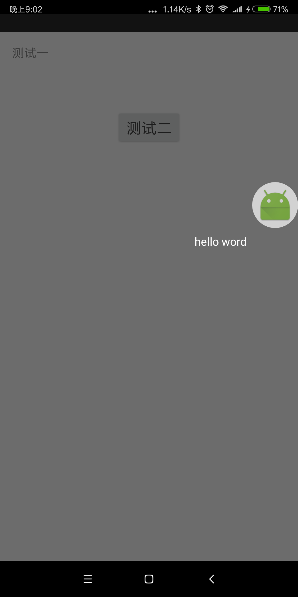

# GuideView

 - gradle
 ```
   compile 'cn.Lemon:guideview:0.1.6'
 ```

 - 方法回调顺序
 ```
  * 方法回调：创建GuideView -- initParams(初始化参数) -- getTargetViewPosition(获取TargetView位置核心方法) --
  * show(添加GuideView进DecorView) -- addHintView -- GuideView.onMeasure -- GuideView.onLayout -- GuideView.Draw -- drawMaskLayer(绘制完毕)
 ```

 - 使用
 ```
     @Override
     public void onResume() {
         super.onResume();
         fragment.post(new Runnable() {
             @Override
             public void run() {
                 showGuideViews();
             }
         });
     }

     public void showGuideViews() {
         TextView mHintView = new TextView(getActivity());
         mHintView.setText("列夫·托尔斯泰曾在《安娜·卡列尼娜》里说过：幸福的家庭都是相似的");
         mHintView.setTextSize(20f);
         mHintView.setTextColor(Color.WHITE);

         mGVOne = new GuideView.Builder(getActivity())
                 .setTargetView(R.id.text_one)
                 .setHintView(mHintView)
                 .setHintViewDirection(Direction.BOTTON)
                 .setTransparentOvalPadding(20)
                 .setHintViewMarginTop(100)
                 .setOnClickListener(new View.OnClickListener() {
                     @Override
                     public void onClick(View v) {
                         mGVOne.hide();
                         mGVTwo.show();
                     }
                 })
                 .create();
         mGVOne.show();

     }
 ```

 - Demo效果图




##License

This project is licensed under the terms of the Apache License 2.0

>